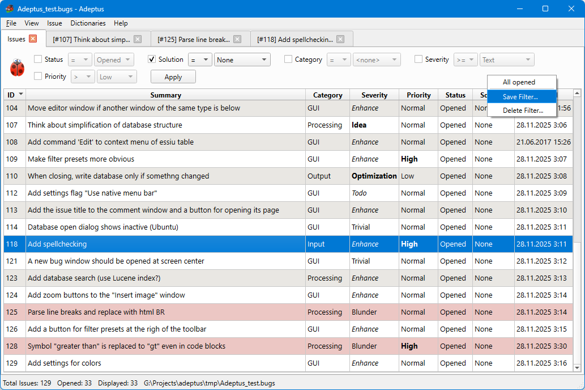
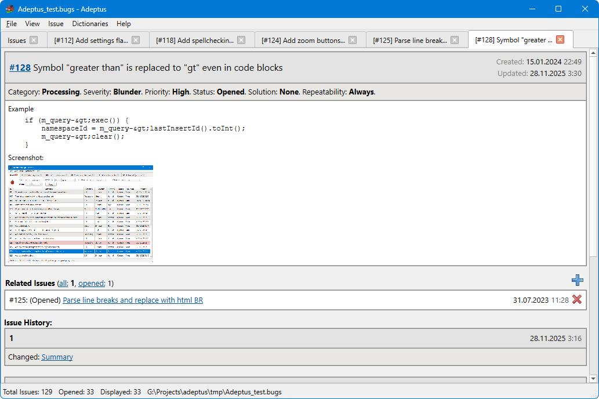
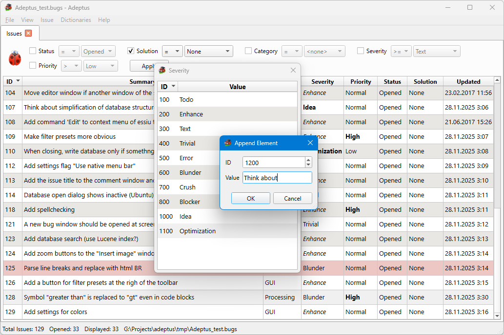

# Adeptus

Adeptus is a simplistic issue, task, and idea-tracking application for personal projects.

It's a handy tool that I've found to be convenient for my personal projects such as [reZonator](https://github.com/orion-project/rezonator2), [Spectrum](https://github.com/orion-project/spectrum), [Procyon](https://github.com/orion-project/procyon), Adeptus itself, and many others.

Adeptus manages the project's issues, storing them in a single SQLite database (plus one single folder for attachments). It intentionally doesn't use any backend server; you are free to choose your favored sync service, like Dropbox or Google Drive, to share the database between your working machines.

Apart from textual description, issues contain several dictionary properties, like “Category” or “Severity”; possible values can be configured for every database independently according to particular projects' needs. *(TODO: add issue tags like in GitHub)*. Issues also can have attachments like example files or screenshot images. Issues can have relations to other issues.

### Screenshots

The main window with the issue table, filter panel, and filter presets menu:

[](./img/screens/table_1.1.2.png)

An issue page with a detailed description, pasted image, relations panel, and changes history:

[](./img/screens/history_1.1.2.png)

A dictionary editor for the “Severity” property and how you can add a new value for the property:

[](./img/screens/dictedit_1.1.2.png)

## Build

Clone the repository

```bash
git clone https://github.com/orion-project/adeptus
```

Update submodules:

```bash
cd adeptus
git submodule init
git submodule update
```

Note, that submodules are in 'detached head' state by default.
